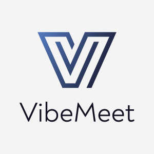
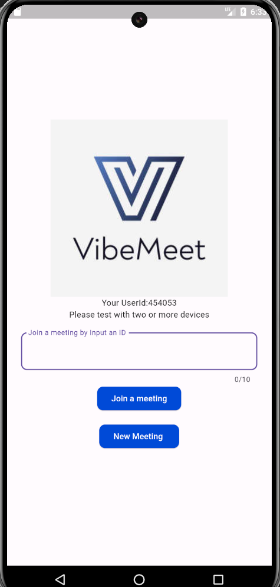
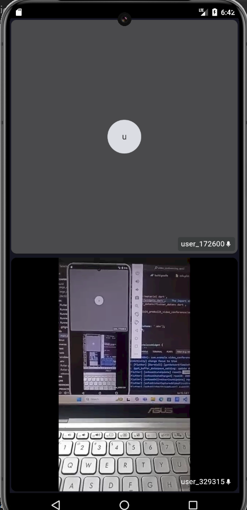
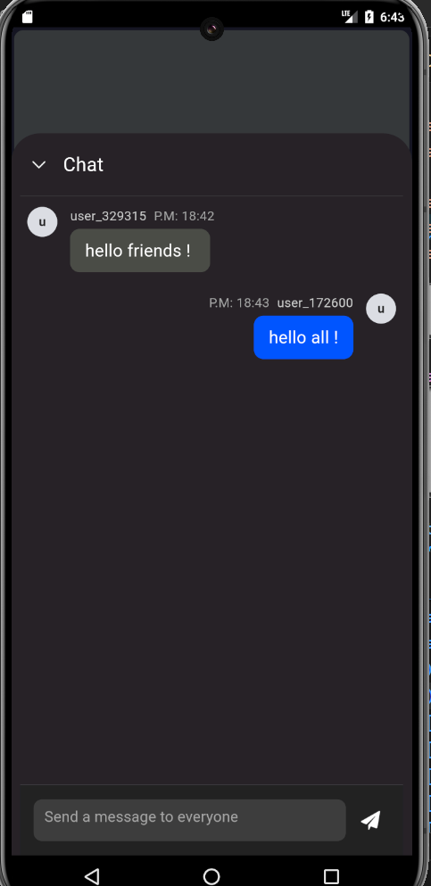

# VibeMeet - Video Conferencing App



## Overview

**VibeMeet** is a feature-rich video conferencing app built using Flutter and Dart, powered by Zegocloud's prebuilt video conference solution. Designed for seamless virtual meetings, VibeMeet offers high-quality video and audio, along with user-friendly controls and a modern UI.

## Features

- **High-Quality Video and Audio:** Enjoy clear video and audio during meetings, with minimal latency.
- **Instant Meeting Setup:** Create and join meetings with just a few taps.
- **User Authentication:** Secure login and signup options for user management.
- **Chat Functionality:** Send messages to participants during the meeting.
- **Screen Sharing:** Share your screen with participants for presentations or collaboration.
- **Participant Management:** View and manage participants during a meeting.
- **Responsive UI:** Fully responsive interface, optimized for both Android and iOS devices.

## Screenshots





## Getting Started

To set up and run VibeMeet locally, follow these instructions.

### Prerequisites

- **Flutter SDK**: [Install Flutter](https://flutter.dev/docs/get-started/install)
- **Dart SDK**: [Install Dart](https://dart.dev/get-dart)
- **Zegocloud Account**: [Sign up for Zegocloud](https://www.zegocloud.com/)
- **IDE**: Visual Studio Code or Android Studio recommended

### Installation

1. Clone the repository:

   ```bash
   git clone https://github.com/VijaySelvaraj19/Zoom_app_clone.git
   cd Zoom_clone_app

2. Fetch dependencies:
   ```bash
   flutter pub get

3. Run the app:
   ```bash 
   flutter run   

